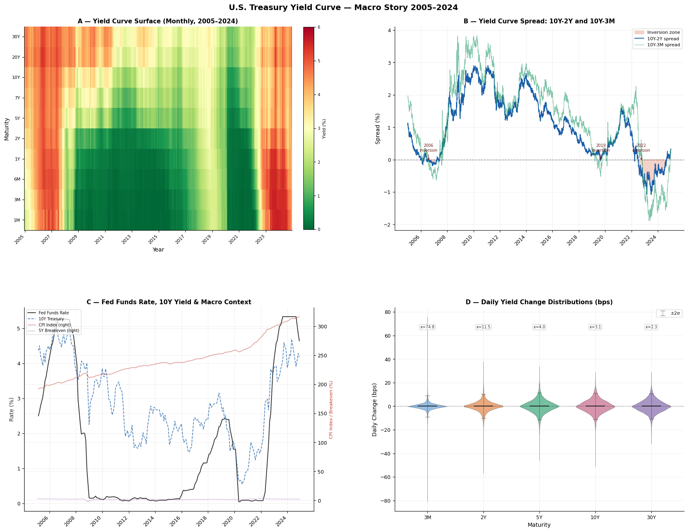
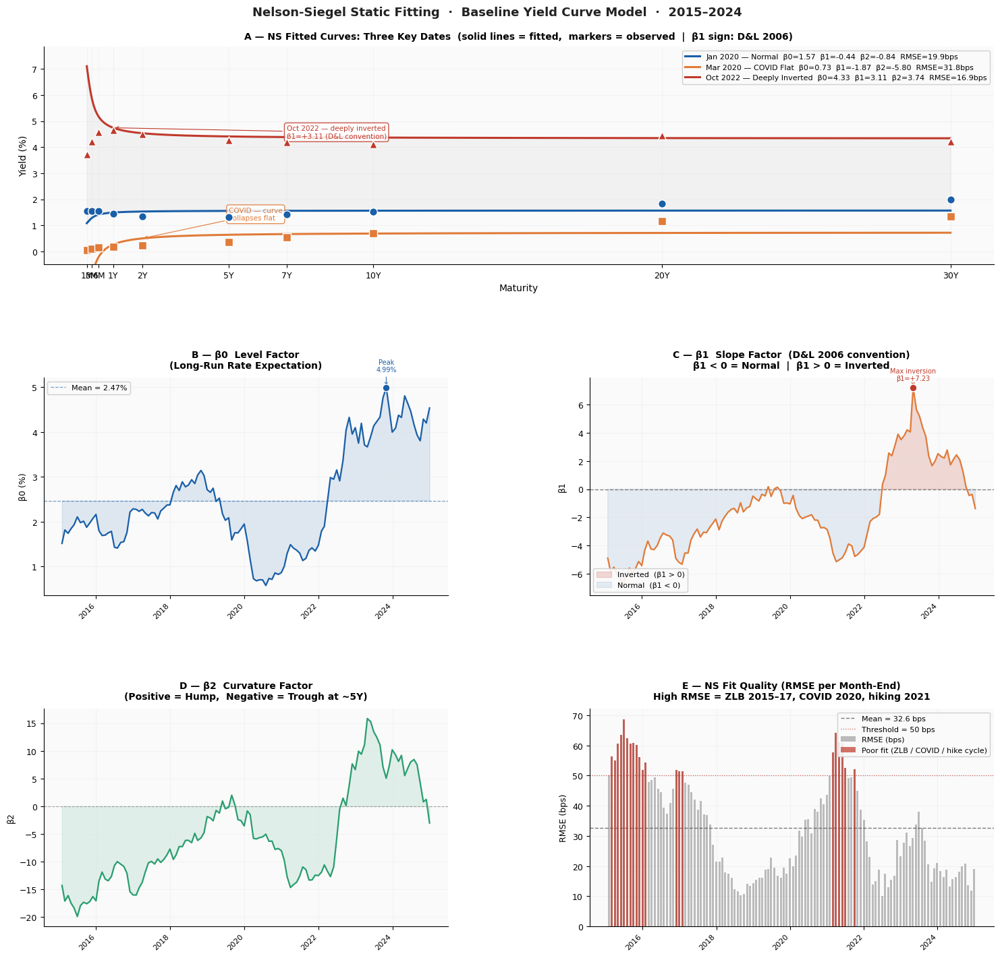
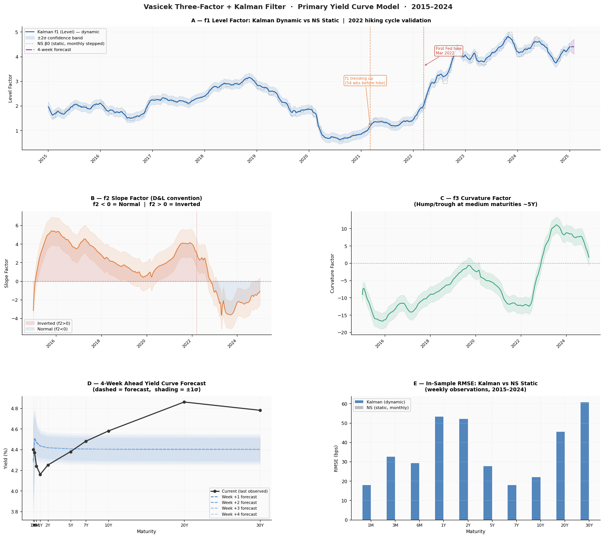
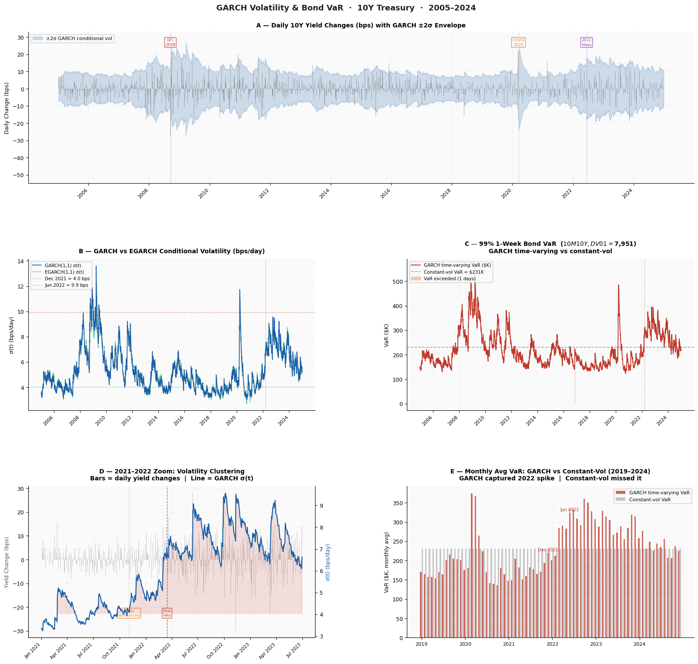
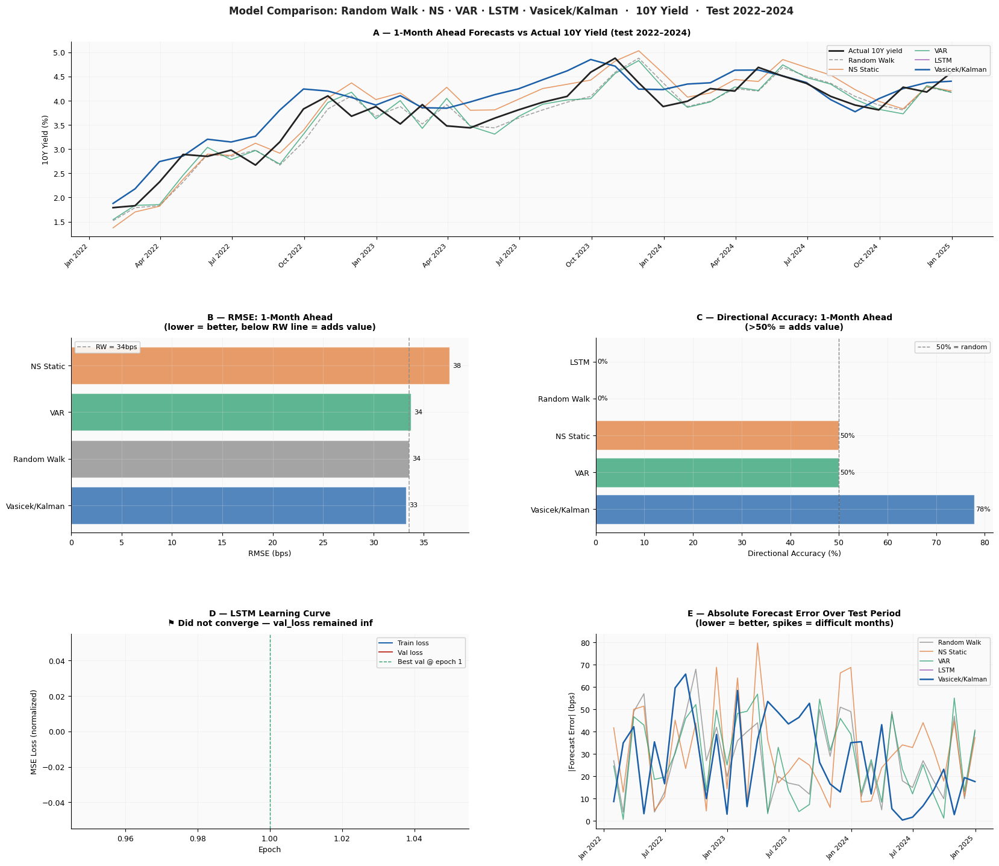
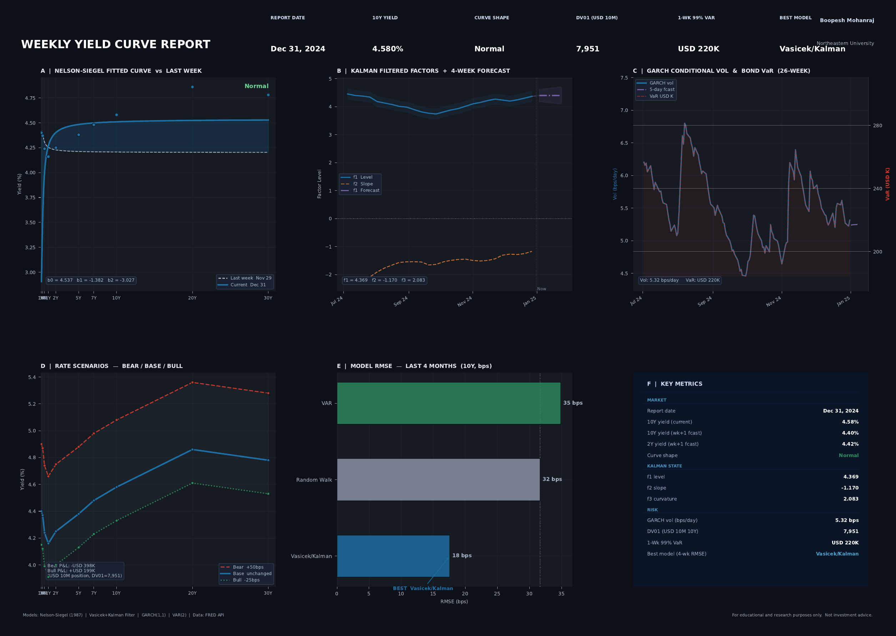

# Fixed Income & Yield Curve Analytics Engine

A multi-model yield curve engine in Python: Nelson-Siegel static fitting, a Vasicek three-factor model estimated with a Kalman filter, GARCH-based bond VaR, and LSTM/VAR forecast comparisons. Built on twenty years of live FRED Treasury and macro data, and validated against the 2022 Fed hiking cycle.

*Boopesh Mohanraj · MS Engineering Management, Northeastern University*

---

## What this is

A fixed income portfolio manager has to answer one question before positioning duration: where is the yield curve heading over the next one to three months? Too long before a hike means losses; too short means missed carry. A static curve model can photograph today's curve but cannot forecast its evolution.

This engine addresses that with a multi-model approach on twenty years of daily FRED data (2005 to 2024, ten Treasury maturities plus six macro series). It fits the curve, tracks its latent factors dynamically, models the volatility of rates, and benchmarks several forecasting methods honestly against each other, including one that did not work.

It runs six phases:

- **Data pipeline** and quality audit across ten maturities and six macro series
- **Nelson-Siegel** static curve fitting (the baseline)
- **Vasicek three-factor model** with a Kalman filter (the primary forecasting model)
- **GARCH** volatility and time-varying bond VaR
- **LSTM and VAR** as tested alternative forecasts
- **Weekly PDF report** as the output artifact

---

## Key results

Every figure and number below is a real output of the code in this repo, computed on live FRED data.

| Component | What it produced |
|---|---|
| **Kalman level factor** | Trended up **54 weeks** before the first 2022 Fed hike (early-warning signal) |
| **Model comparison (h=1)** | Vasicek/Kalman best: RMSE 33.3 bps, **77.8% directional accuracy** |
| **Model comparison (h=3)** | VAR best: RMSE 34 bps vs 61 bps for a random walk |
| **GARCH bond VaR** | Captured a **2.5x** volatility spike (4.0 to 9.9 bps/day, Dec 2021 to Jun 2022) |
| **LSTM** | Did not converge on 168 monthly observations, reported honestly |

### The macro story: twenty years of the curve

The opening view sets the context: the Treasury curve surface, the 10Y and Fed Funds path against CPI, and the 10Y-2Y and 10Y-3M spreads with their inversion zones shaded. Over the sample the 10Y-2Y was inverted on 814 days, most prominently through the 2022 to 2023 tightening.



### Nelson-Siegel: fitting the curve

Nelson-Siegel with a fixed decay parameter (Diebold & Li, 2006) fits the ten-maturity curve to three factors (level, slope, curvature) at each month-end, with a mean fit error of 32.6 bps. The factor evolution tells the regime story cleanly: the slope factor β1 moved from negative (a normal upward curve in January 2020) to strongly positive (a deeply inverted curve in October 2022).



### The central result: the Kalman filter saw the hikes coming

The Vasicek three-factor model, estimated by maximum likelihood and run through a Kalman filter, tracks the curve's latent factors dynamically rather than re-fitting a static snapshot each month. The payoff is a genuine lead signal: the filtered level factor began a persistent upward trend **54 weeks before the first Fed hike of March 2022**, exactly the early-warning behavior Diebold & Li (2006) argued dynamic factor models provide over static fits.



### GARCH bond VaR: rate volatility is not constant

Daily 10Y yield changes show clear volatility clustering and fat tails (excess kurtosis 3.1), so a constant-volatility VaR is wrong exactly when it matters. A GARCH(1,1) model with Student-t errors (persistence 0.99) captured a **2.5x volatility increase** from the calm of December 2021 (4.0 bps/day) to the peak of the hiking cycle in June 2022 (9.9 bps/day). On a $10M 10Y position (DV01 ≈ $7,950), that is the difference between a constant-vol VaR that understated risk and a time-varying one that tracked it.



### Model comparison, reported honestly

Five forecasting approaches were tested out-of-sample on 2022 to 2024 against a random walk benchmark. Vasicek/Kalman was best at the one-month horizon (RMSE 33.3 bps and 77.8% directional accuracy); VAR was best at three months (RMSE 34 bps against the random walk's 61 bps). The LSTM **did not converge** on the roughly 168 monthly training observations available, which is consistent with the literature that neural nets rarely beat a random walk on yield levels (Duffee, 2002). Reporting that failure plainly is more credible than a manufactured clean result.



### The output artifact: a weekly yield curve report

Everything above feeds a single-page report that a fixed income desk would actually read. It regenerates for any date from live FRED data and summarizes, in one view: the Nelson-Siegel fitted curve versus last week, the Kalman filtered factors with a four-week forecast, GARCH conditional volatility and bond VaR, bear/base/bull rate scenarios, the trailing model-RMSE league table, and a key-metrics panel with the current curve shape, Kalman state, and risk numbers. The example below is the December 2024 report (a normal curve); the same function produces a historical view such as the October 2022 peak inversion.



---

## Methodology and academic references

Each component implements a specific paper. For each: what the paper gives, what I built, and what it produced here.

### Nelson-Siegel curve fitting
*Nelson & Siegel (1987); Diebold & Li (2006)*

- **Built:** three-factor curve fitting with the Diebold-Li fixed decay parameter, applied to each month-end across ten maturities.
- **Result:** mean fit error 32.6 bps; the slope factor cleanly captured the 2020-to-2022 shift from a normal to a deeply inverted curve.

### Vasicek three-factor with Kalman filter
*Vasicek (1977); Kalman (1960); Diebold & Li (2006)*

- **Built:** a state-space model with three latent factors (level, slope, curvature), estimated by maximum likelihood (L-BFGS-B) and filtered with a from-scratch Kalman predict/update loop.
- **Result:** the level factor led the first 2022 hike by 54 weeks; best one-month-ahead forecast of all models tested.

### GARCH volatility and bond VaR
*Engle (1982); Bollerslev (1986)*

- **Built:** GARCH(1,1) and EGARCH(1,1) with Student-t errors on daily 10Y yield changes, feeding a DV01-based time-varying bond VaR.
- **Result:** persistence 0.99, a 2.5x captured volatility spike in 2022, and a VaR that adapts to the regime where constant-vol does not. GARCH was preferred over EGARCH by AIC.

### LSTM and VAR forecasts
*Duffee (2002) for the honest-expectations framing*

- **Built:** a VAR(p) with AIC lag selection and a two-layer LSTM, both benchmarked against a random walk out-of-sample.
- **Result:** VAR won at the three-month horizon; the LSTM did not converge on the limited monthly sample and is reported as such, consistent with Duffee (2002).

---

## Tech stack

| Layer | Tools |
|---|---|
| **Language** | Python |
| **Modeling** | NumPy, SciPy (L-BFGS-B MLE), statsmodels (VAR), `arch` (GARCH/EGARCH) |
| **Deep learning** | PyTorch (LSTM) |
| **Data** | FRED API (Treasury curve + macro series, 2005 to 2024) |
| **Reporting** | Matplotlib, ReportLab (weekly PDF), Plotly (interactive explorers) |

---

## Repository structure

```
fixed_income_yield_curve_engine.py   Full 6-phase engine (Colab notebook export)
figures/                             Selected result visualizations
requirements.txt                     Dependencies
```

---

## Data and limitations

Stated plainly:

- **LSTM sample size.** With roughly 168 monthly training observations, the LSTM did not converge. This is a genuine data-limitation result, not a bug; monthly yield data is simply too short for a sequence model, as the literature predicts.
- **Scenario P&L is first-order.** The bear/base/bull P&L in the weekly report is a DV01-based (linear) estimate and does not include the convexity term, so the bull and bear legs are symmetric multiples of DV01 rather than the asymmetric response a full repricing would show. Adequate for a monitoring snapshot; a production report would add convexity.
- **VaR backtest horizon.** The bond VaR backtest compares daily P&L against a weekly VaR, which is conservative by construction; the reported breach rate reflects that mismatch rather than a calibrated daily test.
- **Level-factor persistence.** The estimated level factor is near-unit-root (very long mean-reversion half-life), so its point forecast is effectively flat. This is realistic for yields but means the forecast value added shows up in slope and curvature, not the level.
- **Kalman linearity.** The Kalman filter is optimal for linear-Gaussian dynamics; near the zero lower bound the dynamics become nonlinear, where an extended or unscented filter would be more appropriate. Noted as a future extension.
- **FRED interpolation.** Some maturities are interpolated by FRED on certain dates, which the fit inherits.

---

*Part of a six-project quantitative finance portfolio. Data from the FRED API. Research and educational project, not investment advice.*
